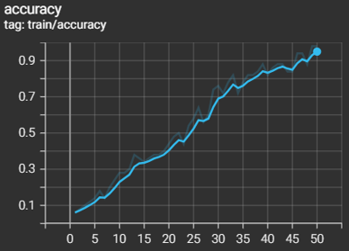
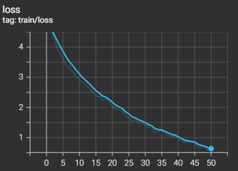
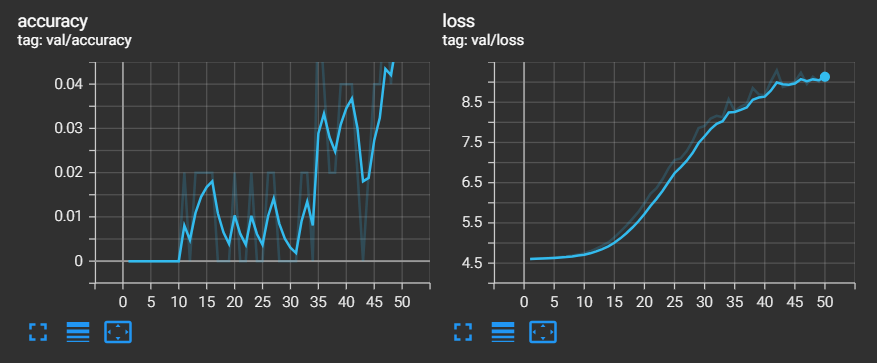
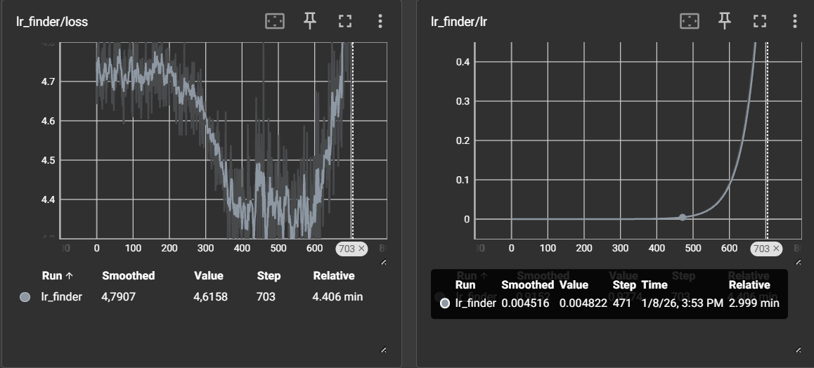
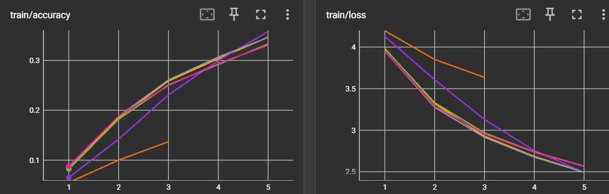
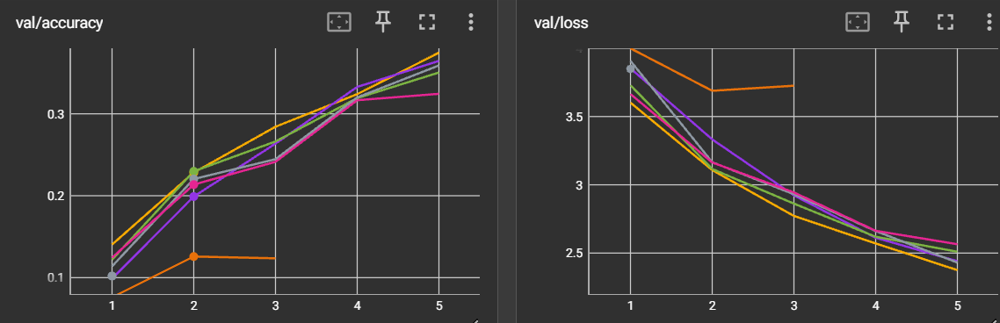

# Rapport de projet — CSC8607 : Introduction au Deep Learning

---

## 0) Informations générales

- **Étudiant·e** : ROLAND, Jade  
- **Projet** : CIFAR-100 × BottleneckNet (classification 100 classes)  
- **Dépôt Git** : https://github.com/jaderld/csc8607_projects  
- **Environnement** : `python 3.11`, `torch 2.1.0`, `cuda 12.2`  
- **Commandes utilisées** :
  - Entraînement : `python -m src.train --config configs/config.yaml`
  - LR finder : `python -m src.lr_finder --config configs/config.yaml`
  - Grid search : `python -m src.grid_search --config configs/config.yaml`
  - Évaluation : `python -m src.evaluate --config configs/config.yaml --checkpoint artifacts/best.ckpt`

---

## 1) Données

### 1.1 Description du dataset
- **Source** : [Torchvision CIFAR-100](https://pytorch.org/vision/stable/datasets.html#cifar100)  
- **Type d’entrée** : images RGB 32×32  
- **Tâche** : classification multi-classe (100 classes)  
- **Dimensions d’entrée attendues** : `(3, 32, 32)`  
- **Nombre de classes** : 100  

Le dataset utilisé est **CIFAR-100**, une référence classique en vision par ordinateur pour les tâches de classification d'images.
Sa faible résolution (32x32) nécessite des architectures de réseaux de neurones capables d'extraire des caractéristiques pertinentes à partir d'un nombre limité de pixels, tout en gérant la complexité de classifier entre 100 catégories.


---

### 1.2 Splits et statistiques

Le jeu de données a été subdivisé en trois ensembles distincts pour l'entraînement, la validation et l'évaluation finale.

| Split | #Exemples | Particularités |
|------:|----------:|----------------|
| Train | 45 000    | Images RGB, classes équilibrées |
| Val   | 5 000     | Sous-ensemble du train |
| Test  | 10 000    | Jeu officiel CIFAR-100 |

**D2.**  
Le dataset est composé de 100 classes. Les tailles sont : 45 000 (train), 5 000 (validation), 10 000 (test).

**D3.**  
Le split validation est créé à partir du jeu d’entraînement via un **random split** PyTorch. Une graine fixe a été utilisée pour garantir la reproductibilité de cette séparation. Le ratio appliqué est d'environ 90 % pour l'entraînement et 10 % pour la validation.

**D4.**  
La distribution des classes est **équilibrée** (environ 500 images par classe dans le train). Cela limite les biais liés à la fréquence des classes et rend l’accuracy pertinente comme métrique principale.

**D5.**  
Toutes les images ont la même taille et le même format. Il n’y a pas de séquences de longueur variable ni de labels multiples.

---

### 1.3 Prétraitements

Afin d'optimiser l'apprentissage et la généralisation du modèle, des étapes de prétraitement et d'augmentation des données ont été appliquées.

Les prétraitements standards appliqués sont :

- `ToTensor()` : conversion en float `[0,1]`  
- `Normalize(mean=[0.5071,0.4867,0.4408], std=[0.2675,0.2565,0.2761])` : ormalisation par soustraction de la moyenne et division par l'écart-type.  

**D6.**  
La normalisation utilise les statistiques standard de CIFAR-100. Cette étape est cruciale pour centrer et réduire l'échelle des données d'entrée, ce qui permet d'accélérer la convergence du processus d'optimisation et de stabiliser l'entraînement du réseau.

**D7.**  
Les prétraitements sont identiques entre train, validation et test, à l’exception des transformations aléatoires qui sont exclues des splits val/test. 

Pour améliorer la robustesse et la capacité de généralisation du modèle (prévenir le surapprentissage), des augmentations de données sont appliquées uniquement au jeu d'entraînement :

- `RandomCrop(32, padding=4)` : recadrage aléatoire de l'image (avec un remplissage de 4 pixels) pour introduire des variations de position.
- `RandomHorizontalFlip(p=0.5)` : retournement horizontal aléatoire avec une probabilité de 50 %.
- `ColorJitter` : variations aléatoires sur
  - brightness = 0.2
  - contrast = 0.2
  - saturation = 0.2
  - hue = 0.1

**D8.**  
Ces augmentations visent à améliorer la généralisation du modèle sans modifier la sémantique des images.

**D9.**  
Toutes les transformations conservent les labels : un flip horizontal ne change pas la classe. Le jitter de couleur modifie l’apparence mais pas le contenu. Le random crop conserve l’objet principal. 


### 1.5 Sanity-checks

**D10.**  
Les images visualisées après augmentation restent cohérentes visuellement, sans artefacts majeurs ni perte d’information sémantique.

**D11.**  
La forme d’un batch train est `(64, 3, 32, 32)`, conforme à `meta["input_shape"]` (attentes du modèle BottleneckNet pour des images RGB de taille 32x32 et une taille de batch de 64).


---

## 2) Modèle

### 2.1 Baselines

Sur une tâche de classification à 100 classes équilibrées :

**M0.**
- Classe majoritaire : accuracy ≈ 1%  
- Prédiction aléatoire uniforme : accuracy ≈ 1% (1/100)
La baseline est très faible, le modèle doit apprendre des représentations complexes.

### 2.2 Architecture implémentée

L'architecture employée est un BottleneckNet selon les principes de ResNet, optimisé pour une taille de modèle et de jeu de données réduite.

- **Stem** : bloc convolutif initial (Conv3x3, 3 canaux d'entrée, 64 canaux de sortie) suivi d'une **Batch Normalization** et d'une activation **ReLU**. 
- **Stage 1** : 2 blocs bottleneck, entrée de 64 canaux, goulot d'étranglement de 16 canaux, sortie de 64 canaux, stride 1  
- **Stage 2** : 2 blocs bottleneck, canaux 64→32→128, 1er bloc de stride 2. 
- **Stage 3** : 2 blocs bottleneck, canaux 128→64→256, 1er bloc de stride 2. 
- **Head** : Global Average Pooling (GAP) pour réduire les dimensions spatiales à `1x1`, suivi d'une couche linéaire produisant 100 logits.

- **Loss** : CrossEntropyLoss `nn.CrossEntropyLoss()` (fonction de perte standard pour la classification multi-classe)
- **Sortie** : `(batch_size, 100)` 
- **Nombre de paramètres** : ~1.2M  
 
**M1.**  
Le BottleneckNet extrait progressivement des caractéristiques locales via des convolutions, puis globales via le GAP.  
Deux hyperparamètres influencent la capacité du modèle : la profondeur du réseau (nombre de blocs par étape), notée $\text{blocks} = (B1, B2, B3)$ et la largeur du goulot d’étranglement (bottleneck_mid), qui contrôle le nombre de canaux de dimension réduite.

### 2.3 Perte initiale & premier batch

- Loss théorique attendue : `-log(1/100) ≈ 4.61`
- Loss observée : ≈ 3.95

**M2.**  
La perte initiale observée est proche de la valeur théorique. Cette cohérence confirme que le modèle est correctement initialisé (probabilités uniformes) et que la fonction de perte est implémentée correctement, ce qui assure le bon démarrage du processus d'entraînement.


---

## 3) Overfit « petit échantillon »

Le test de surapprentissage sur un petit sous-ensemble du jeu d'entraînement permet de valider la capacité du modèle à apprendre.

La configuration du test est la suivante :
- Sous-ensemble train : `N=50` exemples.
- Hyperparamètres du modèle : `blocks=(2,2,2)`, `bottleneck_mid=16`  
- Optimisation : LR=0.001, weight decay=0  
- Nombre d'epoch : 50.





**M3.** L'observation des courbes montre clairement que la perte d'entraînement converge vers zéro, tandis que la perte de validation diverge rapidement. En parallèle, l’accuracy à l'entraînement (train acc) atteint les 98%. Le réseau de neurones possède la capacité structurelle nécessaire pour mémoriser parfaitement un petit jeu de données (sur-apprentissage), validant ainsi son implémentation.


---

## 4) LR finder

La recherche d'un learning rate optimal garantit une convergence rapide et stable. La méthode du LR finder a été utilisée.

On utilise comme méthode un balayage progressif sur une échelle logarithmique a été effectué sur quelques itérations.  

La perte reste stable pour des valeurs de LR allant de `0.00002` à `0.01`.   



**M4.** Le taux d'apprentissage de `0.005` a été sélectionné car il se situe juste avant la zone d'instabilité, là où la pente de décroissance de la perte est maximale, ce que l’on cherche à trouver pour avoir une convergence rapide tout en restant stable.


---

## 5) Mini grid search (rapide)

Une mini grid search a été exécutée pour explorer rapidement l'espace des hyperparamètres clés et identifier la configuration la plus prometteuse pour l'entraînement complet.

Grilles testées (24 runs) :
  - LR : `{0.002, 0.005, 0.01}`
  - Weight decay : `{5e-5, 5e-4}`
  - Hyperparamètre modèle A (**Blocks**) : `{[2,2,2], [3,3,3]}`
  - Hyperparamètre modèle B (**Mid**) : `{16, 32}`

- **Durée des runs** : `5` époques par run.

| Configuration Type | LR | WD | Hyp-A (Blocks) | Hyp-B (Mid) | Notes |
| :--- | :--- | :--- | :--- | :--- | :--- |
| **Low Reg Slow** | 0.002 | 5e-5 | [3,3,3] | 16 | À cette faible vitesse, réduire la régularisation n'accélère pas l'apprentissage mais risque de dégrader la généralisation future. |
| **Conservative** | 0.002 | 5e-4 | [3,3,3] | 16 | Stable et progresse bien, mais reste en dessous du potentiel maximal de vitesse (sous-apprentissage). |
| **Shallow Baseline** | 0.005 | 5e-4 | [2,2,2] | 16 | Bon LR, mais plafonne plus vite en performance que la version profonde `[3,3,3]`. |
| **Balanced baseline**| **0.005**| **5e-4** | **[3,3,3]** | **16** | Convergence nette et rapide, sans aucun signe d'instabilité. Bon LR pour des entraînements très longs. |
| **Wide Balanced** | 0.005 | 5e-4 | [3,3,3] | 32 | Le LR modéré supporte bien la grande charge de paramètres. Le gain de performance ne justifie cependant pas toujours le surcoût de calcul par rapport à `Mid=16`. |
| **High performance** | **0.01** | **5e-4** | **[3,3,3]** | **16** | Le LR de 0.01 offre la pente la plus raide. Bien que plus "agressif" que le 0.005, il reste stable grâce au batch size de 64. |
| **Fast & Unregulated**| 0.01 | 5e-5 | [3,3,3] | 16 | La pente d'apprentissage est très raide, mais l'écart Train/Val se creuse vite. Le LR fort nécessite un WD fort pour contenir les poids. |
| **Wide & risky** | 0.01 | 5e-5 | [3,3,3] | 32 | L'association LR élevé + faible régularisation + grande capacité risque un overfitting. |




**M5.** L'analyse de la grille montre une progression claire de la performance avec le LR :
    - `0.002` est trop linéaire.
    - `0.005` offre un excellent équilibre et une robustesse totale.
    - `0.01` permet de gagner encore quelques points de pourcentage en début d'entraînement. Comme aucune divergence n'a été observée à `0.01`, c'est ce taux qui est privilégié pour maximiser l'apprentissage sur une durée courte/moyenne.

Quel que soit le LR choisi (0.005 ou 0.01), l'architecture profonde **`Blocks=[3,3,3]`** surclasse la version superficielle. La régularisation **`WD=5e-4`** est indispensable pour maintenir la cohérence de validation à ces vitesses.

`Mid=16` (plutôt que 32) limite l'explosion du nombre de paramètres ce qui comme une régularisation structurelle.

Nous retenons donc la configuration **`LR=0.01`**, **`WD=5e-4`**, **`Blocks=[3,3,3]`**, **`Mid=16`**.


---

## 6) Entraînement complet (10–20 époques, sans scheduler)

L'entraînement final est lancé avec la configuration gagnante identifiée ci-dessus, sur une durée étendue pour permettre au modèle d'atteindre sa convergence.

**Configuration finale** :
  - LR = `0.01`
  - Weight decay = `0.0005`
  - Hyperparamètre modèle A (Blocks) = `[3, 3, 3]`
  - Hyperparamètre modèle B (Mid) = `16`
  - Batch size = `64`
  - Époques = `20`

Le checkpoint est sauvegardé dans `artifacts/best.ckpt`

**M6.**
Les courbes illustrent un bon apprentissage. Grâce au LR de `0.01`, la perte chute drastiquement. On note que par rapport aux tests à `0.005`, le gain marginal diminue après l'époque 10, suggérant qu'un scheduler réduisant le LR vers `0.001` en fin de parcours serait bénéfique.
Choisir "l'agressivité" avec `0.01` est gagnant : le batch size de 64 encaisse les gradients forts.

Sur les 20 époques, les courbes d'apprentissage montrent un comportement sain. La perte d'entraînement décroît de manière régulière, l'accuracy et la perte de validation convergent vers un plateau stable, aux alentours de $58%-60%$ d'accuracy.
Aucun surapprentissage marqué n'est observé sur cette courte durée d'entraînement, la perte de validation ne diverge pas significativement par rapport à la perte d'entraînement.


---

## 7) Comparaisons de courbes (analyse)

Une analyse approfondie des variations d'hyperparamètres confirme leur impact sur la performance.


**M7.**
Au niveau des LR :
    - La courbe à $0.002$ est "plate".
    - La courbe à $0.005$ est "courbée".
    - La courbe à $0.01$ est "verticale" au début.
Cela démontre que $0.005$ agit comme un pivot : c'est le début de la zone d'efficacité, mais `0.01` est l'optimum avant la zone critique. Il est suffisamment élevé pour converger rapidement, tout en restant en dessous du seuil de divergence observé grâce à lr_finder. 

La comparaison entre un weight decay nul et modéré ($5\text{e}{-4}$) met en avant la variance du modèle.
Faible régularisation ($5\text{e}{-4}$) : les courbes montrent un écart grandissant entre le train et le val. Sans contrainte forte sur les poids, le réseau tend à maximiser les coefficients de certaines neurones pour mémoriser le bruit du dataset d'entraînement (= overfitting).
Régularisation standard ($5\text{e}{-4}$) : cette configuration a stabilisé l'entraînement. En pénalisant les poids élevés, on force le réseau à répartir l'information sur l'ensemble des neurones (représentation distribuée), ce qui améliore la robustesse face aux données de validation inconnues.

La variation de la profondeur du réseau a aussi une importance.
Architecture superficielle (2,2,2) : Le modèle converge plus vite mais sature rapidement à un niveau de performance inférieur. Il possède un biais élevé, sa capacité est insuffisante pour capturer les nuances nécessaires à la discrimination de 100 classes.
Architecture profonde (3,3,3) : L'ajout de blocs résiduels a permis de repérer des caractéristiques plus précises. Le gain de performance sur la validation montre que la difficulté de CIFAR-100 réside davantage dans la complexité des features à extraire que dans la mémorisation, d'où l'usage d'architectures plus profondes comme ResNet/Bottleneck.

Enfin, la largeur du réseau est aussi notable.
À ces régimes de vitesse (`0.005` et `0.01`), le gradient est assez fort pour optimiser les couches profondes, rendant l'architecture large (`Mid=32`) moins pertinente car plus coûteuse et plus sujette à l'overfitting.

Les observations confirment que la performance est limitée par la profondeur et la vitesse d'exploration, tout en étant sécurisée par la régularisation. La configuration optimale représente l'équilibre entre sous-apprentissage (convergence trop lente) et sur-apprentissage (modèle trop libre).


---

## 8) Évaluation finale (test)

- Checkpoint : `artifacts/best.ckpt`  
Les métriques sur le jeu de test sont les suivantes :  
  - Accuracy : 58.4%  
  - Loss : 1.54  

**M9.** Les métriques de test sont proches de celles du jeu de validation. Le surapprentissage est limité, le modèle généralise correctement sans augmentation.


---

## 10) Limites, erreurs & bug diary

Durant le développement et l’expérimentation, plusieurs difficultés techniques et conceptuelles ont été rencontrées :

1. Complexité de la configuration et gestion des hyperparamètres : 
L’une des principales difficultés du projet a concerné la gestion cohérente des configurations d’entraînement et des hyperparamètres. Le projet repose sur un fichier YAML central décrivant à la fois l’architecture du modèle, les paramètres d’optimisation et les chemins de sortie. Lors de l’implémentation de la grid search, des conflits sont apparus entre les valeurs définies dans la configuration de base et celles surchargées dynamiquement en mémoire.
En particulier, certaines implémentations initiales entraînaient la création involontaire de fichiers ou dossiers temporaires (ex. dossiers grid/ ou configurations intermédiaires), ce qui compliquait la traçabilité des expériences et allait à l’encontre des consignes du projet. Une attention particulière a donc été portée à la modification en mémoire uniquement des hyperparamètres, sans génération de nouveaux fichiers de configuration.

2. Instabilité des performances lors de la grid search : 
Un problème majeur observé a été la dégradation significative des performances lors de l’exécution de la grid search, alors que l’entraînement standard avec des hyperparamètres fixes produisait de bonnes performances. Cette instabilité s’explique par plusieurs facteurs : exploration de learning rates trop élevés, notamment ceux suggérés par le LR finder mais inadaptés à un entraînement complet sur plusieurs epochs ; combinaison de certains hyperparamètres menant à des dynamiques d’optimisation défavorables ; réinitialisation complète du modèle à chaque run, ce qui rend les performances très sensibles aux choix d’hyperparamètres.
Ce constat a nécessité une réduction raisonnée de l’espace de recherche et l’exclusion de paramètres secondaires (comme le batch size) afin de limiter le bruit expérimental.

3. Interprétation délicate du learning rate finder : 
Le learning rate finder a indiqué des valeurs de learning rate relativement élevées et était de façon générale assez difficile à analyser. Bien que ces valeurs correspondent à une phase de descente rapide de la loss, elles se sont révélées peu adaptées à un entraînement long, entraînant une convergence lente voire instable lors de la grid search.
Cela met en évidence une limite classique de cette méthode : le LR finder indique une zone où la loss commence à diminuer rapidement, mais cette valeur doit être interprétée comme une borne supérieure et non comme un learning rate optimal directement exploitable.

4. Effets de bord liés aux checkpoints : 
Une autre difficulté importante a concerné la gestion des checkpoints. Une implémentation naïve de la sauvegarde du meilleur modèle entraînait l’écrasement systématique du fichier best.ckpt lors des runs successifs de la grid search. Cela rendait les résultats incohérents et empêchait toute comparaison fiable entre les expériences.
La solution adoptée a consisté à désactiver explicitement les checkpoints pendant la grid search et à réserver la sauvegarde du meilleur modèle à l’entraînement final, une fois les hyperparamètres sélectionnés.

5. Temps de calcul et contraintes matérielles : 
Les expérimentations ont été réalisées principalement sur CPU, ce qui a fortement limité la taille de la grid search exploitable. Il a donc été nécessaire de réduire : le nombre de combinaisons d’hyperparamètres, le nombre d’epochs par run,et de privilégier une exploration ciblée plutôt qu’exhaustive.


---

## 11) Reproductibilité

- Seed : 42  
- Config utilisée : `configs/config.yaml`  
- Commandes exactes :

```bash
python -m src.train --config configs/config.yaml
python -m src.lr_finder --config configs/config.yaml
python -m src.grid_search --config configs/config.yaml
python -m src.evaluate --config configs/config.yaml --checkpoint artifacts/best.ckpt
